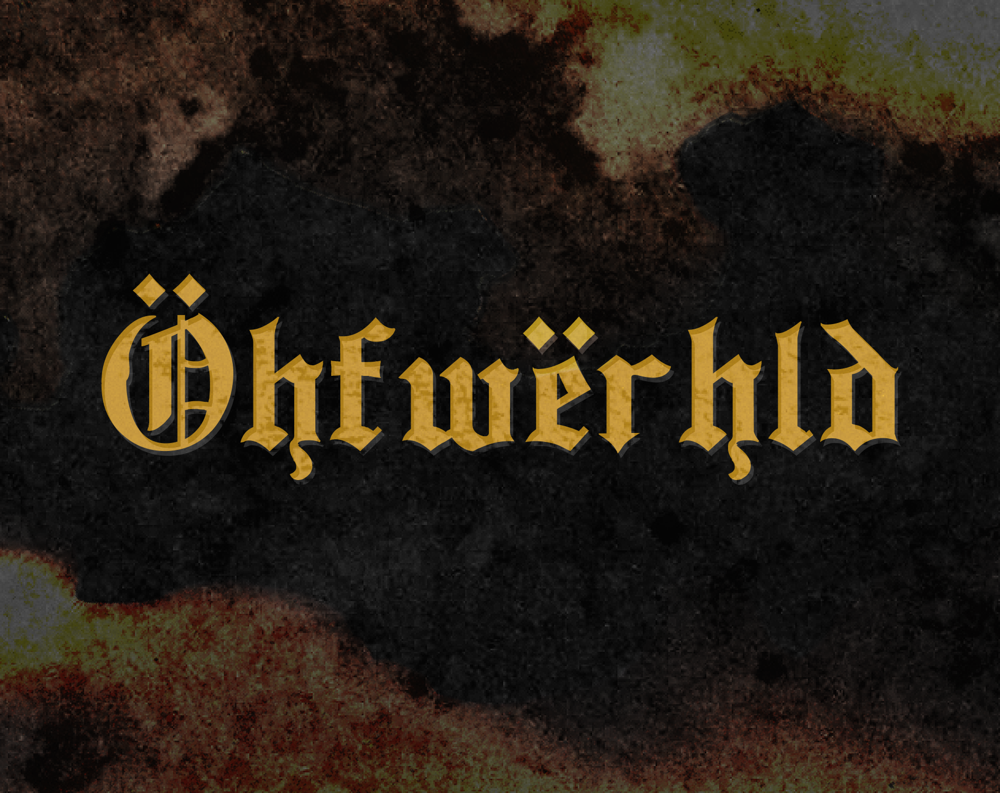

_[Öhfwërhld](https://bruhstin.itch.io/ohfwerhld)_ is a horror game made in 10 days using [ink](https://www.inklestudios.com/ink/) for [ECTOCOMP 2023 (English)](https://itch.io/jam/ectocomp-2023-english) and the [Bare Bones Jam](https://itch.io/jam/bare-bones-jam).

Inspired by a dream.

Content Warnings:

- Reference to gore.
- Drowning.
- Dead bodies.
- Unnatural cognitive and sensory experiences.

Notes:

- This game is entered under ECTOCOMP's *Le Grand Guignol* category (took 4+ hours to write).
- Following the Bare Bones Jam's rules, this game's UI format hasn't been altered in anyway.
- This game was originally intended for entry into inkJam 2023 as well but couldn't meet the deadline. Its theme, "In the blink of an eye..." is mentioned throughout the text.
- Fun fact: Half of this was made in a daze while I was sick!
